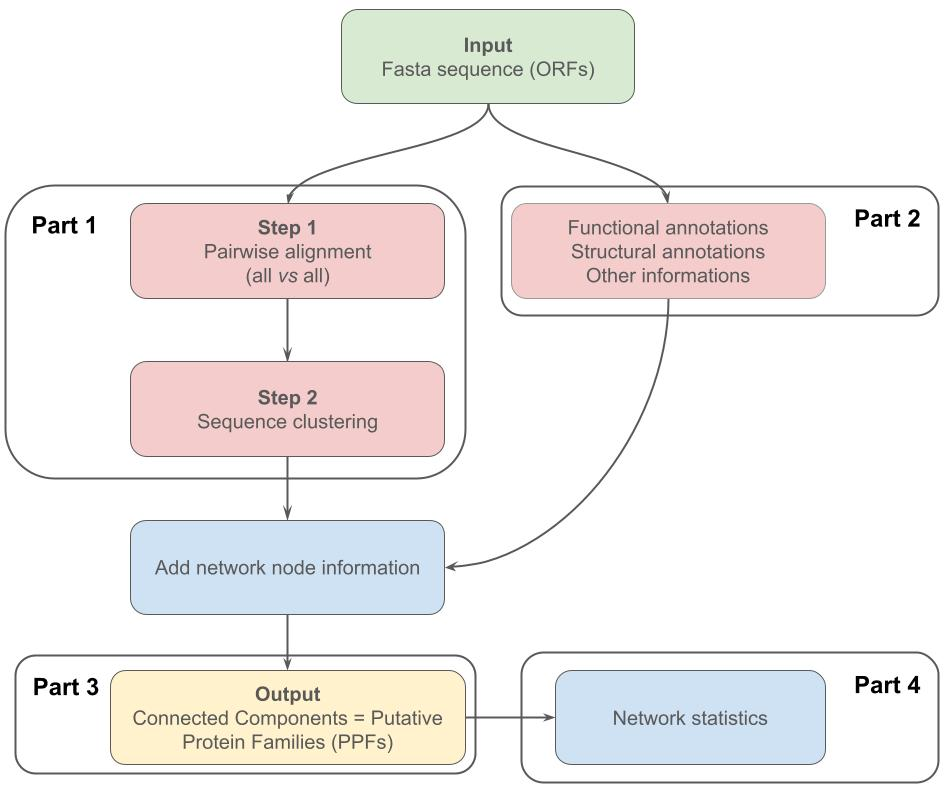

# LAGOON-MCL

version 1.0.1

## Table of content

* [Presentation](index.md)
* [Intallation](installation.md)
* [Command line options](command.md)
* [Citing LAGOON-MCL](citation.md)
* [Contribution and Support](contact.md)

## Introduction

LArGe cOmparative Omics Networks (LAGOON) Markov CLustering algorithm (MCL) is developed by the [Atelier de BioInformatique](https://bioinfo.mnhn.fr/abi/presentation.EN.html) team of the [Institute of Systematics, Evolution, Biodiversity - UMR 7205](https://isyeb.mnhn.fr/en) ([National Museum of Natural History](https://www.mnhn.fr/en), Paris, France).

LAGOON-MCL is a new version of [LAGOON](https://github.com/Dylkln/LAGOON.git) developed by Dylan Klein.

LAGOON-MCL is a FAIR pipeline that uses [Nextflow](https://www.nextflow.io/) as a workflow manager. The objective of this pipeline is to be able to construct Putative Protein Family (clusters) using [Markov CLustering algorithm](https://github.com/micans/mcl) and pairwise alignments obtained with [Diamond](https://github.com/bbuchfink/diamond).

* [Nextflow version 23.10.0.5889](https://www.nextflow.io/docs/latest/index.html)
* [Singularity version 4.1.0](https://docs.sylabs.io/guides/4.1/user-guide/)
* [Diamond version 2.1.8](https://github.com/bbuchfink/diamond/wiki?)
* [SeqKit version 2.6.1](https://bioinf.shenwei.me/seqkit/)
* [Markov CLustering algorithm version 22-282](https://github.com/micans/mcl)

## Pipeline

